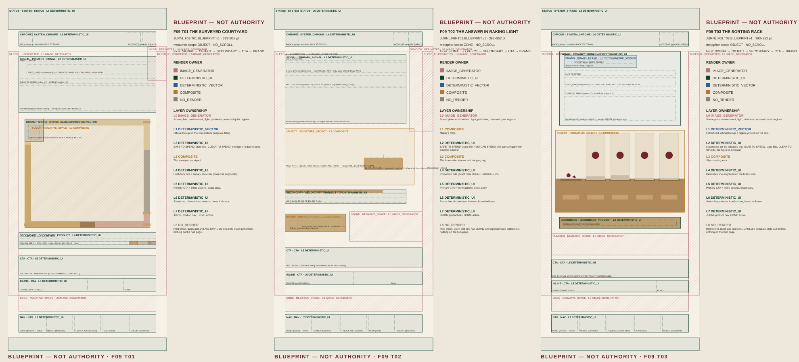

# JURNL F09 SAFE TO SPEND — Composition Blueprint + Render Ownership Correction 1

**Sprint:** `P0.JURNL.F09-SAFE-TO-SPEND.COMPOSITION-BLUEPRINT-RENDER-OWNERSHIP-CORRECTION1` · 2026-10-06
**Generations:** 0 primary · 0 paid · **Page implementation:** none

## What went wrong

Both previous rounds asked an image model to paint the whole phone screen: the scene, every word and figure, the logo, the chrome and the nav. The methodology said what each territory means and how the brand should feel. It never said how the page is laid out, or which renderer owns which part. So the model guessed. It did two things wrong:

- **The metaphor took over the page.** The T01 courtyard fills about 69 % of the stage, with the number inside it. The T02 inscription became a full-page poster.
- **The product came out inexact.** "JURL" on the T01 cornerstone. "TRIPS." missing from the T02 sentence, with the tag hanging after AND. All three logos redrawn as a generic three-leaf sprig. T03 envelope thickness ignores the data. In the founder-run ChatGPT pass, T03 also picked up journal copy from another surface ("A QUIETER YOU", "BEGIN YOUR JOURNEY"), a journal cover and broken nav.

The render report marked typography, logo and anti-AI as PASS. That was wrong, and the audits are now corrected (`F09_INVALID_RENDER_LEDGER.json`).

## The rule now

> **An image generator may contribute to a product authority, but it may not be the sole renderer of precision product UI.**

The new pipeline: territory → creative direction → brand expression → **page composition blueprint** → **render-layer ownership** → text-free art plates → deterministic UI and brand assembly → **composite authority** → founder review.

## The three blueprints

The zone maps are documentation, stamped BLUEPRINT — NOT AUTHORITY. None of them is a candidate.

| | T01 THE SURVEYED COURTYARD | T02 THE ANSWER IN RAKING LIGHT | T03 THE SORTING RACK |
|---|---|---|---|
| Metaphor scope | **OBJECT**: the courtyard, about 41 % of the stage | **ZONE**: the brass after-clause | **OBJECT**: the rack, about 32 % of the stage |
| Signal | Centred on a quiet terrace above the courtyard | Left-aligned carved column, with the figure in emerald enamel | Letterpress on the released slip at the top |
| Signature object | Courtyard: floor = 80.4 % of the room (clear ÷ cash); four wall courses in proportion to BILLS · PLAN · GOALS · TRIPS | The held-back words in brass; a $2,400 ASSIGNED tag hangs from YOUR PLAN | Five slots. Slot 1 is empty (the slip came from it; broken seal). Envelopes 2–5 have thickness in proportion to their amount |
| Secondary module | Survey scale bar + HELD BACK $6,075 OF $30,960 CASH | Proportion rule (80.4 % brass, rest an empty groove) + held-back line | Brass strip with the held-back line |
| Brand | Official lockup on the blank cornerstone | Maker's plate: lockup + FINANCIAL LIFE, BEAUTIFULLY ORGANIZED. | Letterhead on the slip: lockup + PLAN TODAY. GROW FREELY. |
| CTA | 616–664 pt; inline actions 672–704 | 596–644; 656–688 | 626–670; 678–706 |

Every page shares the same frame:

- **Viewport:** 393×852 pt.
- **Chrome:** square icon buttons at 59–95 pt.
- **Stage:** x 26.5–366.5, y 108–714.
- **Edge:** an empty strip at 714–754.
- **Nav:** five cells at 762–806, with HOME active.

Data geometry is computed from `computeSafeToSpend`, using the QA-seed sample. See `F09_COMPOSITE_ASSEMBLY_CONTRACT.json` → `data_geometry`.

## Who renders what

| Layer | T01 | T02 | T03 |
|---|---|---|---|
| L0 environment | IMAGE_GENERATOR | IMAGE_GENERATOR | IMAGE_GENERATOR |
| L1 brand frame | DETERMINISTIC_VECTOR | COMPOSITE (blank brass plate + official lockup) | DETERMINISTIC_VECTOR |
| L2 signal | DETERMINISTIC_UI | DETERMINISTIC_UI | DETERMINISTIC_UI |
| L3 signature object | COMPOSITE (plate material masked to data geometry; labels exact) | COMPOSITE (blank tag from the plate; brass sampled from the plate; letterforms exact) | COMPOSITE (plate objects; thickness, labels, seal emboss exact) |
| L4 secondary | DETERMINISTIC_UI | DETERMINISTIC_UI | DETERMINISTIC_UI |
| L5 CTA · L6 chrome · L7 nav | DETERMINISTIC_UI | DETERMINISTIC_UI | DETERMINISTIC_UI |
| L8 overlays | NO_RENDER | NO_RENDER | NO_RENDER |

## Files

| File | What |
|---|---|
| `F09_T0n_COMPOSITION_BLUEPRINT.json` | Blueprint (zones, slots, overlaps, depth, focal order, responsive logic) plus its gate check and density metrics |
| `F09_T0n_RENDER_OWNERSHIP.json` | One owner per layer L0–L8, plus its gate check |
| `F09_RAW_GENERATION_CONTRACT.json` | One text-free scene plate per territory: prompt, quiet regions, blank surfaces, materials, generator QA, baked-UI guard |
| `PLATE_PROMPTS/T0n_SCENE_PLATE.txt` | The plate prompts. They contain no product, brand or copy words. |
| `PLATE_GUIDES/F09_T0n_PLATE_GUIDE_9x16.png` | The only reference a plate generation may receive: tonal blocks and data-true object geometry, with no text |
| `F09_COMPOSITE_ASSEMBLY_CONTRACT.json` | Official logo (with hash), fonts, chrome, nav, buttons, canonical copy, data bindings and geometry, pending decisions, composite QA |
| `F09_RENDER_CONTAMINATION_GUARD.json` | Per territory: required and forbidden copy, allowed and forbidden references (with hashes), prompt and blueprint hashes, run rules |
| `F09_INVALID_RENDER_LEDGER.json` | RUN A (founder ChatGPT, not ingested) and RUN B (OpenArt, hashed): every defect; superseded prompts |
| `F09_HYBRID_GATE_STATUS.json` | Hybrid gate state and verdict |
| `ZONE_MAPS/` | Labelled blueprints and the board |

Every JSON and prompt is generated by `npx tsx scripts/studioos/jurnl-f09-composition-blueprint-export.ts`, from `shared/studioos-visual-authority/projects/jurnl/f09-composition-blueprint.ts`. The images are drawn by `node scripts/jurnl/f09-blueprint-render.mjs`. The methodology lives in `shared/studioos-visual-authority/hybrid-authority.ts` and `docs/studioos/visual-authority-development/`.

## Open founder decisions (slots reserved, copy unchanged)

- **D-F09-PRIMARY-ACTION-LABEL:** SEE THE FULL BREAKDOWN stays until you decide (your example was WHY THIS AMOUNT).
- **D-F09-PURCHASES-BRIDGE:** CHECK A PURCHASE → F10 is not on the page. If you approve it, it replaces PLAN › in the inline row.
- **D-F09-AVAILABLE-DATE:** not rendered. The formula has no horizon, so a date would be invented.

## Next: hybrid render execution

1. Generate one scene plate per territory (3 primary generations) from `PLATE_PROMPTS/`, attaching only its plate guide, in a fresh session. Check the hashes against the guard first.
2. Run generator QA, OCR (any glyph means reject) and the baked-UI score on the quiet regions.
3. Assemble the deterministic layers at 393×852 and render the composites.
4. Run composite QA, the richness audit and the 2-second clarity check, then build the founder board from the composites (plates appear as provenance only).

**Verdict:** pipeline corrected · ready for hybrid render execution · not ready for founder comparison (no composites exist yet).
