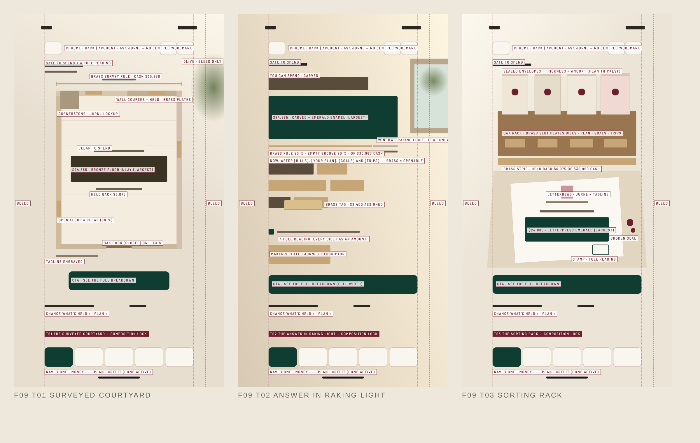

# JURNL F09 SAFE TO SPEND — Creative Direction + Brand Expression Correction 1

**Sprint:** `P0.JURNL.F09-SAFE-TO-SPEND.CREATIVE-DIRECTION-BRAND-EXPRESSION-CORRECTION1` · 2026-10-06

## Status

| Step | Status |
|---|---|
| Structural territories | **Preserved** from territory proof 1 (T01 · T02 · T03; same primary objects, verified by the gate) |
| Creative-direction gate (methodology) | **Added**. See `docs/studioos/visual-authority-development/CREATIVE_DIRECTION_GATE.md` |
| Brand-expression gate (methodology) | **Added**. See `…/BRAND_EXPRESSION_GATE.md` |
| JURNL identity load | **Done**: `JURNL_CREATIVE_DIRECTION_PROFILE.json` |
| Creative direction (3 territories) | **CREATIVE_DIRECTION_READY ×3** |
| Brand expression (3 territories) | **BRAND_EXPRESSION_READY ×3** (19/19 each) |
| Creative distinctness | **10/10 dimensions on every pair** |
| Composition locks + Sunburst prompts | **Done** |
| Sunburst 4K candidates | **NOT GENERATED. Blocked on the renderer route** (see `GENERATION_LEDGER.json`) |
| Anti-AI audit / review board / comparison | Baseline done for the previous round; corrected round **pending candidates** |
| Founder verdict | PENDING |

## The three creative directions

| | T01 THE OPEN FLOOR → **THE SURVEYED COURTYARD** | T02 THE PLAIN ANSWER → **THE ANSWER IN RAKING LIGHT** | T03 THE OPEN ENVELOPE → **THE SORTING RACK** |
|---|---|---|---|
| Art direction | Overhead architectural photograph of one Mediterranean courtyard, annotated like a survey | One sunlit limestone wall seen straight on; a single carved sentence | Entry-hall still life at morning: oak letter rack over a travertine console |
| Bespoke idea | **Negative space is the money.** The open floor is the spendable amount, inlaid in bronze; the commitments are the walls, one limestone course each. | **Only the words that hold money are made of metal.** Held-back words are inlaid in brass (they open); one hangs an engraved tag; the held share of the rule is an empty carved groove. | **The broken seal.** The only letter you've opened is the money you can spend; its JURNL-embossed seal lies broken beside it. Sealed envelopes' thickness = their amount. |
| Logo / lockup | Carved limestone **cornerstone** with the botanical mark + JURNL; tagline engraved on the wall face | Brushed-brass **maker's plate** with the mark + JURNL + FINANCIAL LIFE, BEAUTIFULLY ORGANIZED. | **Letterhead** of the opened letter + the botanical mark pressed into every wax seal; PLAN TODAY. GROW FREELY. |
| Depth | Orthographic top-down | Frontal shallow relief | Three-quarter still life |
| Data encoding | Floor area ÷ room = clear ÷ cash; course length = each hold | Brass words + half-filled rule | Envelope thickness; open vs sealed |
| CTA | Emerald tile on the axis below the closed oak door | Full-width emerald slab under generous stone | Emerald tile under the console |

**Chrome change in all three.** No centred wordmark: the lockup lives in the scene, as the founder directed. Back, account and ask stay square-rounded icons. The 5-item nav is unchanged.

## Files

| File | What |
|---|---|
| `JURNL_CREATIVE_DIRECTION_PROFILE.json` | JURNL identity load: brand lines, philosophy, logo / tagline system, colour / material / environment / object worlds, type, graphic rules, wit, must-not-become, anti-generic, anti-AI, renderer, provenance |
| `F09_T0n_CREATIVE_DIRECTION.json` | Each translation: 22 fields, bespoke idea, render brief, authorship devices, 12 locks, exact text, forbidden elements + both gate checks and brand-expression evidence |
| `SUNBURST_PROMPTS/T01_OPEN_FLOOR.txt` · `T02_PLAIN_ANSWER.txt` · `T03_OPEN_ENVELOPE.txt` | Production prompts. The IMAGE brief comes first, then all 20 required sections, built from the locks. |
| `COMPOSITION_LOCKS/` | Labelled lock diagrams + unlabelled value studies (the composition reference for a reference-guided renderer), 9:16 |
| `CREATIVE_DIRECTION_DISTINCTNESS_MATRIX.json` | 10 creative dimensions × 3 territories + gate result |
| `ANTI_AI_VISUAL_AUDIT.json` | Previous-round baseline audit (minor flags) + brand-expression failures; corrected round pending |
| `PREVIOUS_VS_CORRECTED_COMPARISON.json` | Previous-round scores (1–5); corrected pending |
| `F09_CREATIVE_GATE_STATUS.json` | Gate summary. **Corrected round:** CANDIDATE_REQUIRED (only the render is missing). **Previous round:** CREATIVE_DIRECTION_REQUIRED. |
| `GENERATION_LEDGER.json` | Renderer spec, routes checked, 0 generations, plan |
| `REFERENCE_CANDIDATES_4K/` | Empty until generation |

All JSON and prompt files are generated by `npx tsx scripts/studioos/jurnl-f09-creative-direction-export.ts`. The source is `shared/studioos-visual-authority/projects/jurnl/{creative-direction-profile,f09-creative-direction}.ts`. Locks are rendered by `node scripts/jurnl/f09-composition-lock-render.mjs`.

## What unblocks generation

The profile renderer is **GPT IMAGE 2.5 SUNBURST · 4K · 9:16 · AUTO-ENHANCE OFF**. JURNL canon also makes it **reference-guided**. Two routes:

1. **OpenArt** (JURNL's canonical provider, 4K, image2image). Allowed for Opus: the founder clarified the no-OpenArt rule applies to ChatGPT only. The founder grants access through an environment credential or a connector, then a **new session** picks it up.
1a. **Interim, founder-run:** ChatGPT image generation with `CHATGPT_PROMPTS/*_CHATGPT.txt`, attaching the territory value study (`COMPOSITION_LOCKS/*_VALUE_STUDY_9x16.png`) and the official logo. The outputs come back here for the anti-AI audit, review board and comparison.
2. **Figma `generate_image` with `gpt-image-2.5-sunburst`.** Available now, but text-only and capped at 2048 px, so it needs a recorded founder exception for 4K and for reference-guided generation.

Nothing renders until one is chosen.
