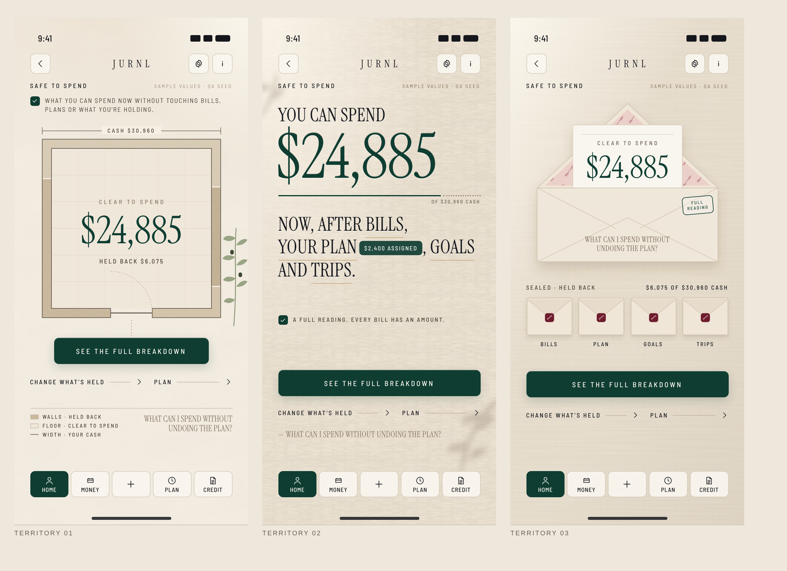
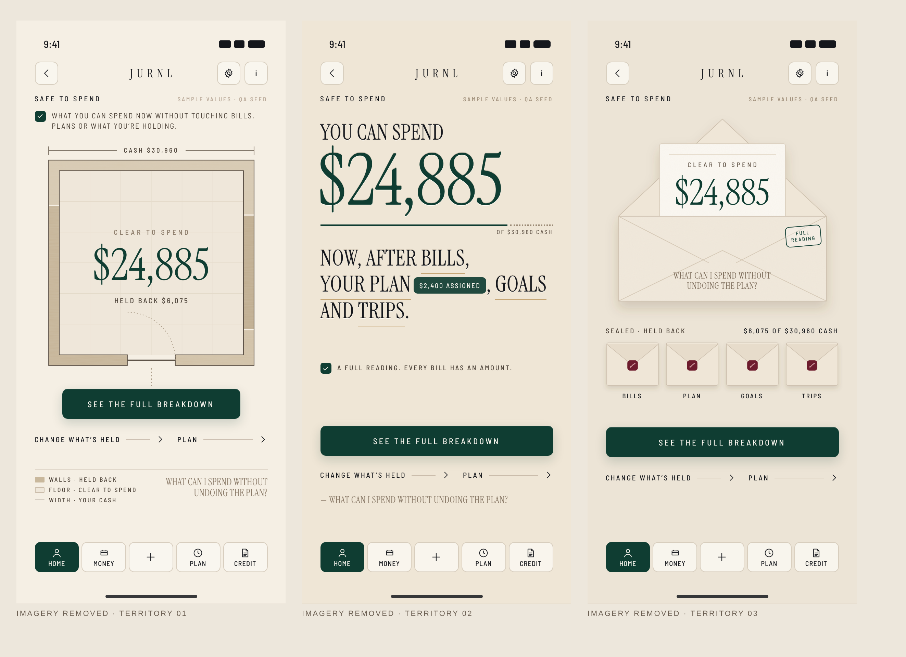

# F09 SAFE TO SPEND — Founder Review Pack

**Status:**
- 3 TERRITORIES PRODUCED
- 3 REFERENCE CANDIDATES PRODUCED
- **FOUNDER REVIEW REQUIRED**

No winner is selected. Nothing is locked. No page is implemented.

## The three territories

| | T01 THE OPEN FLOOR | T02 THE PLAIN ANSWER | T03 THE OPEN ENVELOPE |
|---|---|---|---|
| Premise | What you can spend is the open floor of a room; what's held back is the wall around it. | One plain sentence answers the question, set into stone; each held-back thing is a word you can open. | One envelope is open: what you can spend. Everything held back is sealed beside it. |
| Primary object | A drawn room (plan view) | The answer sentence | The open envelope + its slip |
| Reads as | Space left after commitments | JURNL saying the answer aloud | What's put away vs what's yours |
| Held back shown as | Unnamed wall area (proportional) | Words with inline amounts | Labelled sealed envelopes |
| Interaction | Tap a wall → it is named in place; the door opens to the breakdown | Open one word at a time | Open a seal → its slip rises |
| Material | Plaster, travertine poché | Travertine, inscribed | Linen, paper, wax, botanical liner |
| Contract | [T01](F09_TERRITORY_01_CONTRACT.md) | [T02](F09_TERRITORY_02_CONTRACT.md) | [T03](F09_TERRITORY_03_CONTRACT.md) |

## Blur test (imagery removed)

All three still read as SAFE TO SPEND from structure alone: **PASS · PASS · PASS**. The blurred variants are in `BLUR_TEST/`.

## What to judge

1. **Five-second read.** Within five seconds, which page tells you how much you can spend, how sure that is, and that something is already held back?
2. **Family identity.** Which composition would you recognise as SAFE TO SPEND with the screen blurred?
3. **Restraint.** The brief says *one open answer, almost no secondary matter*, and also names the risk *looking empty*. Which one gets that balance right?
4. **Distance from F03.** Which one most clearly is *not* "the figure inside a journal"?
5. **Hard states.** Look at each contract's state matrix for BELOW ZERO and UNSTATED. Which one says the hard states plainly, without shame?
6. **Scale-up.** Which one could carry seven held-back fields and a tablet / desktop derivation without breaking?

## Verdict options per territory

Choose one per territory (schema `FounderAuthorityVerdict`):
- **LOVE_IT**
- **REVISE**
- **REJECT**
- **COMBINE**: name which territory supplies which aspect, e.g. *STRUCTURE from one, MATERIAL from another*
- **REQUEST_FOURTH_TERRITORY**

A selected or combined territory becomes the F09 CLIENT parent authority. Then, in order:
1. Tablet and desktop are derived from it.
2. The page / component / interaction contract is written.
3. The Brain produces the page / tab / state tree.
4. You confirm the tree.
5. Implementation.

## Open founder decisions surfaced by this test

These are not resolved here, because they are product decisions.

| ID | Decision |
|---|---|
| D-F09-UNSTATED-NUMBER | Should UNSTATED / NEEDS_ACCOUNT / NEEDS_SETUP show a number?  • Runtime: always shows one.  • Brief: "the signal cannot be said yet".  • F03: hides it. |
| D-F09-RECOVERY-ACTIONS | One return action per weak state: NEEDS_SETUP → setup, NEEDS_ACCOUNT → MONEY, PARTIAL → UPCOMING. The brief says "one return"; it is not built. |
| D-F09-PRIMARY-ACTION-LABEL | Which label is primary?  • SEE THE FULL BREAKDOWN (code)  • SEE WHY (CORE control rule)  • SEE THE HOLD (catalog) |
| D-F09-BILLS-LABEL | BILLS BEFORE NEXT INCOME promises a date window the formula does not apply. Fix the label or the formula. |
| D-F09-FIGURE-OWNERSHIP | The expression matrix lists SAFE_TO_SPEND_FIGURE as owned by F03 ("do not repeat on F05+"). F09 owns the formula. |
| D-F09-WHY-COMPLETENESS | WHY omits the trip and purchase reserves. Every territory's in-place breakdown needs all seven fields. |
| D-F09-BRAND-CANON | Encode or correct:  • the positioning lines (*MONEY IN SERVICE OF LIFE* / *FINANCIAL LIFE, BEAUTIFULLY ORGANIZED*)  • the audience  • the voice avoid list |

Functional flags carried, not fixed:
- LOAN counts as cash.
- CARD ADDED expenses reduce cash.
- The purchase reserve has no UI writer.
- No live region announces number changes.

## Sample values used in all three candidates

Representational values on real `SafeToSpendBreakdown` fields, from the QA seed device (`scripts/jurnl/mobile-composition-qa.mjs` `seedPopulated`):

| Field | Value | Shown |
|---|---|---|
| cash | $30,960 | yes |
| upcoming (bills) | $1,875 | yes |
| assigned (plan) | $2,400 | yes |
| goalReserved | $900 | yes |
| tripReserved | $900 | yes |
| purchaseReserved · protected · safetyBuffer | $0 | hidden (zero bands hidden) |
| **value** | **$24,885** | yes |
| held back | $6,075 | yes |

**State shown:** COMPLETE (representational).

**Caveat.** The seed's cash includes a LOAN balance, an open functional flag. The figures are representational, not advice.

## Upstream verdict

**PARTIAL.** Read the [scorecard](F09_UPSTREAM_CONTRACT_SCORECARD.md).

Upstream fixed what SAFE TO SPEND must say, feel and refuse, and it kept the legacy UI out entirely. It did not say what the page *is*. Each primary object was invented by the territory author from brand materials, the formula and the brief's abstractions.

## Generation

| Item | Value |
|---|---|
| Primary candidates | 3, one per territory |
| Format | WIREFRAME_PLUS_BRAND_RENDER: hand-authored HTML / CSS / SVG, rendered locally with Chromium at 393×852 @3x |
| Provider | None. No OpenArt and no paid model. |
| Credits / cost | 0 |
| Corrective re-renders | Recorded in [F09_GENERATION_LEDGER.json](F09_GENERATION_LEDGER.json) |
| Tablet / desktop | Not produced (founder selection first) |

## Related documents

- [Source map](F09_SOURCE_MAP.md)
- [Experience summary](F09_EXPERIENCE_SUMMARY.md)
- [Legacy firewall](F09_LEGACY_VISUAL_FIREWALL.md)
- [Distinctness matrix](F09_TERRITORY_DISTINCTNESS_MATRIX.md)
