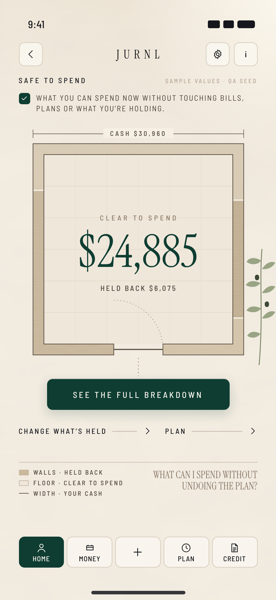

# TERRITORY 01 — THE OPEN FLOOR

**TERRITORY ID** `JURNL.F09.T01` · status IN_REVIEW · founder verdict PENDING

**CONCEPT NAME** THE OPEN FLOOR

**ONE-SENTENCE PREMISE** What you can spend is the open floor of a room, and everything already held back is the wall around it.

## Source-truth derivation

**Brand principles**
- Luxury architectural lifestyle.
- Plaster, stone and travertine.
- Editorial restraint.
- Natural light.
- Square-rounded controls.
- Emerald for the primary action and the figure.

**F09 contract facts**
- Formula `value = cash − Σ held` → *room = cash, walls = held, floor = value*.
- One wall course per non-zero held-back field ("zero bands hidden").
- Brief: *"One open answer"*, *"the room stays open, not unfinished"*, *"more air"*, *"a single mark"* (the one proportion).
- Brief: *"why stays closed"* → the closed door.
- Expression tree: F09.WHY is *"Same room. The factors."* → the breakdown names the walls of the same room.

**User decision**
- *Is there room left after my commitments, and how much?*
- The answer is literally the room left.

**State logic.** Completeness changes how well the room is *surveyed*: solid, dashed or unmeasured walls. BELOW ZERO closes the floor. See the state matrix below.

**What was invented here (not upstream).** Architectural plan-view drafting as the information language. The loggia brief gave *openness*. The plan drawing, poché walls, dimension line and door are this territory's invention.

## The page

**PRIMARY OBJECT** THE OPEN FLOOR: a drawn room whose open area is the safe-to-spend value and whose wall mass is the held-back total.

**PRIMARY COMPOSITION** One proportional plan drawing on the CENTER_STAGE axis. The room is 300 wide inside the 340 stage. The figure is written on the floor. The door sits in the bottom wall on the + axis. A dashed axis runs from the door to the breakdown button and on to the nav +.

**MAJOR ZONES**
1. FUNCTION LABEL (SAFE TO SPEND) and STATE LINE with its state tile
2. DIMENSION LINE = CASH $X (the room's width)
3. THE ROOM: walls = held back, floor = CLEAR TO SPEND $X, with HELD BACK $Y beneath it
4. DOOR → SEE THE FULL BREAKDOWN
5. INLINE ACTIONS: CHANGE WHAT’S HELD · PLAN
6. LEGEND (WALLS · HELD BACK / FLOOR · CLEAR TO SPEND / WIDTH · YOUR CASH) and EDITORIAL CAPTION (the family question)

**CORE HIERARCHY**
1. The figure on the floor.
2. The state line.
3. Wall-to-floor proportion.
4. The door, then SEE THE FULL BREAKDOWN.
5. Inline actions.
6. Legend, then the editorial question.

**PRIMARY METRIC / STATE TREATMENT**
- The figure is display serif in emerald, inscribed on the floor, with the label CLEAR TO SPEND (OVER BY when negative).
- The single data mark is the floor area: `floor ÷ room = value ÷ cash`, with wall thickness computed from the data. In the sample, 80% of the room is open.
- Completeness lives in the state line and in how the walls are drawn.

**PROTECTED / RESERVED INFORMATION TREATMENT**
- Every held-back field is a wall course: bills, plan assigned, goal set-aside, trip reserve, purchase reserve, protected, buffer.
- Courses are ordered clockwise from the door and are unnamed at rest, separated only by joints. *Why stays closed.*
- Protected and buffer are the user's *own* hold. When they are non-zero they are drawn as the inner lining of the wall, so the user's cushion reads as theirs, distinct from obligations.

**CTA HIERARCHY**
1. **SEE THE FULL BREAKDOWN**: emerald primary, on the axis directly under the door.
2. **CHANGE WHAT’S HELD**: inline action.
3. **PLAN**: inline action.

Chrome: BACK TO TODAY, ACCOUNT, ASK JURNL. Nav: HOME is current; + is Quick Add.

**INTERACTION RHYTHM**
- **Still at rest.** You read the room.
- **Tap a wall course.** That course takes its name and amount in place (e.g. BILLS · $1,875) and the others dim.
- **Tap SEE THE FULL BREAKDOWN, or the door.** The door swings open and every course is named in place before `safe/why` continues the reading in the same room. This matches F09.WHY *"Same room. The factors."*
- **CHANGE WHAT’S HELD.** The hold sheet rises (F09.HOLD dossier; the room steps back).

**ASK JURNL PLACEMENT LOGIC**
- Global chrome (info), unchanged.
- Ask is explanation-only and consent-gated, so it never sits inside the drawing. Advertising it there would show a control that can answer UNAVAILABLE.

**QUICK ADD RELATIONSHIP**
- Nav + (MOVEMENT).
- A saved movement changes cash: the dimension line re-measures and the walls settle to the new floor in one still step.
- A polite live region should announce the new figure. This is missing today.

**BACKGROUND / PERIMETER STRATEGY**
- The ground is plaster: low-frequency texture plus a daylight wash from the upper right.
- One olive sprig at the right outer frame, outside the room's footprint. The brief: *"A little olive at the right edge."*
- The central field is the drawing on calm plaster. Nothing high-contrast crosses it (CENTER_STAGE perimeter rules).

**EDITORIAL ROLE**
- Tertiary.
- The family question is set as the drawing's caption in the title block, after the legend.
- It never explains the number; the legend does.

**MATERIAL / SURFACE LANGUAGE**
- Plaster ground.
- Travertine poché walls with stone grain.
- Floor pavers as hairline joints.
- Ink-taupe drafting lines.
- Emerald figure and primary button.
- No cards, no panels, no paper sheet.

**MOTION / TRANSITION IDEA** (concept only)
- Still by default.
- A recalculation moves walls, never the floor's centre.
- Opening the breakdown is the door's swing plus labels fading onto the courses.
- The hold sheet rises from below.
- Reduced motion: labels appear without the swing.

## Why

**WHY THIS IS SPECIFICALLY JURNL**
- The JURNL world is rooms of plaster and stone in natural light. This territory turns that world into the information itself.
- The room is not a backdrop; it is the measurement.
- Restrained, architectural, quiet.

**WHY THIS IS SPECIFICALLY SAFE TO SPEND**
- Only SAFE TO SPEND is a remainder after commitments.
- The drawing has exactly one variable relationship, *open vs held*, and it is that relationship.
- It is not the F03 figure-in-a-journal: the number lives inside the structure that produced it.

**HOW IT DIFFERS FROM THE OTHER TWO**
- **Spatial and proportional, read centre-out.**
- T02 is linguistic and linear (a sentence read top-down).
- T03 is a set of discrete objects with open / sealed states (depth and scale).
- Here the held-back items are unnamed area. In T02 they are words; in T03 they are labelled objects.

**BLUR-TEST RESULT: PASS.** With plaster, daylight and olive removed (`BLUR_TEST/…_IMAGERY_REMOVED.png`), the page is still a room plan with the figure on its floor, a dimension line for cash and a door into the breakdown. It is unmistakably *what is left after what is held*.

**LEGACY VISUAL DEPENDENCIES: NONE.** See the firewall: no threshold line, no hatched bands, no arched panel.

## State matrix

| State | Treatment (proposal) | Copy (functional) |
|---|---|---|
| COMPLETE | Solid walls, open floor, figure | WHAT YOU CAN SPEND NOW WITHOUT TOUCHING BILLS, PLANS OR WHAT YOU’RE HOLDING. |
| PARTIAL | The BILLS course is drawn dashed: its thickness is unknown | AN ESTIMATE. SOME BILLS OR AMOUNTS ARE STILL MISSING. |
| UNSTATED | No BILLS course (upcoming is not deducted); a dashed gap in the wall | NOT ENOUGH IS KNOWN YET TO SAY. |
| NEEDS_SETUP / NEEDS_ACCOUNT | Unmeasured outline room; no dimension figure. Figure shown or withheld per **D-F09-UNSTATED-NUMBER**. | the canonical state lines |
| BELOW ZERO | The walls meet: no open floor. OVER BY $X sits on the dimension line in wine. Plain, not shamed. | OVER BY |
| NOTHING HELD | Hairline walls only: the whole floor is open | NOTHING IS HELD BACK YET. BILLS, PLANS AND RESERVES WILL APPEAR HERE. |
| LOADING / ERROR | Not built in product. Proposal: the outline drawn without fill. | — |

## Upstream sufficiency (this territory)

| Dimension | Upstream gave | Classification |
|---|---|---|
| FUNCTION | Formula, fields, actions, routes | SUFFICIENT |
| HIERARCHY | "One signal, almost no secondary matter", plus the language layers. No ranked information hierarchy. | PARTIAL |
| USER INTENT | The question and the job | SUFFICIENT |
| COMPOSITION | Plate-era "left signal, right opening" (superseded); nothing page-level | **MISSING** (plan view invented) |
| EMOTIONAL TARGET | Clarity, relief, confidence; still; more air | SUFFICIENT |
| BRAND EXPRESSION | Plaster, travertine, architecture, natural light. No information-drawing language. | PARTIAL |
| DATA PRIORITY | "A single mark" and zero bands hidden. Area encoding invented. | PARTIAL |
| INTERACTION | "Why stays closed"; WHY = same room. Tap-a-course inspection invented. | PARTIAL |
| RESPONSIVE BEHAVIOR | Mobile CENTER_STAGE exact; tablet and desktop for this object undefined | PARTIAL |

## Risks

- Reads as a diagram rather than comfort for users who don't read plans.
- At a low held-back ratio the walls get thin; the drawing must stay a room, not a frame. The legend helps.
- Area is estimated poorly by people, so the figure must stay primary.
- Plan drafting is not encoded JURNL DNA.

## Reference candidate

| Field | Value |
|---|---|
| File | `REFERENCE_CANDIDATES/F09_T01_THE_OPEN_FLOOR_MOBILE_393x852.png` |
| Source | `REFERENCE_CANDIDATES/source/t01.html` |
| Format | WIREFRAME_PLUS_BRAND_RENDER |
| State | COMPLETE |
| Sample values | QA seed (see the review pack) |
