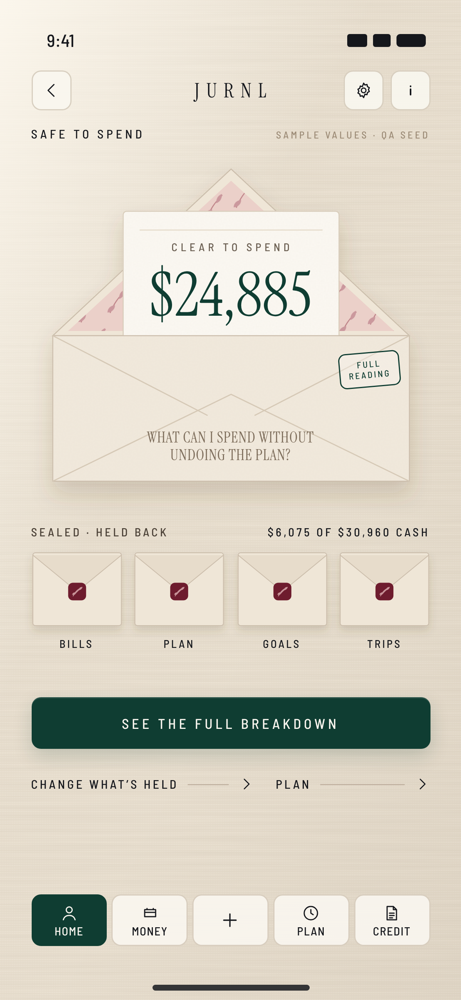

# TERRITORY 03 — THE OPEN ENVELOPE

**TERRITORY ID** `JURNL.F09.T03` · status IN_REVIEW · founder verdict PENDING

**CONCEPT NAME** THE OPEN ENVELOPE

**ONE-SENTENCE PREMISE** One envelope is open, and that is what you can spend. Everything held back is sealed beside it.

## Source-truth derivation

**Brand principles**
- Tactile materiality.
- Paper and textile.
- Champagne, wine, blush and muted rose.
- Botanical language.
- Editorial collage, kept inside an object.
- Square-rounded geometry, so even the wax seals are square-rounded tiles.

**F09 contract facts**
- Brief: *"One open answer"* → the one open envelope.
- Brief: *"Why stays closed"* → the sealed envelopes.
- Expression tree: F09.HOLD is *"What is held back"* (a dossier); IX.HOLD is *"A confirmation. Closed."*
- Data fields are literally named *set aside*, *reserved*, *held*, *assigned*.
- Zero bands hidden: no envelope for a zero field.

**User decision.** *What's mine to use, and what have I already put away?*

**State logic.** Completeness is a stamp on the open envelope (FULL READING / ESTIMATE / NOT ENOUGH KNOWN). The sealed set changes with which fields are counted.

**World constraint used.** The forbidden departure `DARK_BANK_VAULT` steered "safe" away from strongboxes, toward stationery and linen.

**What was invented here (not upstream).** The envelope system itself: object, slip, liner, wax seal and stamp.

## The page

**PRIMARY OBJECT** THE OPEN ENVELOPE, and the slip rising from it with CLEAR TO SPEND $X.

**PRIMARY COMPOSITION**
- One large open envelope on the CENTER_STAGE axis. Its flap is folded back, showing a botanical liner, and the slip carries the figure.
- Beneath it, a row of small sealed envelopes, one per non-zero held-back field, each labelled.
- Breakdown and inline actions below.

**MAJOR ZONES**
1. FUNCTION LABEL (SAFE TO SPEND)
2. THE OPEN ENVELOPE: slip with CLEAR TO SPEND $X · completeness stamp · editorial addressee line (the family question printed on the pocket)
3. SEALED · HELD BACK: $6,075 OF $30,960 CASH, and the sealed envelopes BILLS · PLAN · GOALS · TRIPS
4. SEE THE FULL BREAKDOWN
5. INLINE ACTIONS: CHANGE WHAT’S HELD · PLAN

**CORE HIERARCHY**
1. The slip's figure.
2. The state stamp.
3. Sealed envelopes and their labels.
4. Held-back total.
5. Breakdown.
6. Inline actions.

**PRIMARY METRIC / STATE TREATMENT**
- The figure is emerald display serif on the slip, labelled CLEAR TO SPEND.
- Completeness is a square-rounded ink stamp in the envelope's stamp position (FULL READING).
- No chart. The data mark is *count and state*: open vs sealed.

**PROTECTED / RESERVED INFORMATION TREATMENT**
- Each held-back field is a sealed envelope with a wine seal tile and a label.
- Amounts are sealed at rest. *Why stays closed.*
- Protected and buffer, when non-zero, are the user's own envelopes, sealed in emerald rather than wine. They are the ones CHANGE WHAT’S HELD reseals.

**CTA HIERARCHY**
1. **SEE THE FULL BREAKDOWN**: full-width emerald primary. It opens every seal.
2. **CHANGE WHAT’S HELD**: inline action.
3. **PLAN**: inline action.

Each sealed envelope is a tertiary control: it opens one.

**INTERACTION RHYTHM**
- **Tap a sealed envelope.** Its flap lifts and a slip rises with its amount (e.g. BILLS · $1,875 · SETUP). Tap again to reseal.
- **SEE THE FULL BREAKDOWN.** All envelopes open, then `safe/why`.
- **CHANGE WHAT’S HELD.** The hold sheet rises like a dossier; confirming is *a confirmation, closed*, and the seal is pressed.

**ASK JURNL PLACEMENT LOGIC** Global chrome (info). Ask is consent-gated and explanation-only, so it is never an envelope.

**QUICK ADD RELATIONSHIP**
- Nav + (MOVEMENT).
- After a save the open slip settles to the new figure. Spending lowers the slip into the pocket; income raises it.
- A polite live region announces the figure (missing today).

**BACKGROUND / PERIMETER STRATEGY**
- A natural linen ground with a soft window-light diagonal from the upper left.
- No environment plate.
- Decorative imagery lives *inside the object*: the olive liner of the open flap.
- The perimeter stays quiet; the object is the scene.

**EDITORIAL ROLE**
- Integrated but secondary.
- The family question is printed on the open envelope as its addressee line, below the slip.
- It never carries the number's meaning; the slip and stamp do.

**MATERIAL / SURFACE LANGUAGE**
- Linen.
- Bone and ivory paper with fine grain.
- Blush and rose botanical liner.
- Wine seal tiles.
- Emerald figure, stamp and primary.
- Soft object shadows.

**MOTION / TRANSITION IDEA** (concept only)
- Still at rest.
- A seal opens with a short flap lift and the slip rises; never bouncy.
- Recalculation moves the slip height.
- The hold sheet rises.
- Reduced motion: amounts appear on the envelope faces without the lift.

## Why

**WHY THIS IS SPECIFICALLY JURNL**
- JURNL's world is tactile, paper and textile, botanical, and calm and expensive.
- An envelope with a liner and a seal is that world at hand scale.
- It makes money-set-aside feel cared for, not policed.

**WHY THIS IS SPECIFICALLY SAFE TO SPEND**
- SAFE TO SPEND is exactly the one portion that is *not* put away.
- Open vs sealed is the family's whole logic, made physical.
- It is not F03's journal: no page, no entry, no date. It is a set of put-away things and one open one.

**HOW IT DIFFERS FROM THE OTHER TWO**
- **Discrete objects in depth.**
- Hierarchy comes from scale (one big open envelope, small sealed ones) and state (open / sealed), not from proportion (T01) or grammar (T02).
- Held-back items are labelled objects with sealed amounts. In T01 they are unnamed wall area; in T02, words.
- Interaction is object manipulation.

**BLUR-TEST RESULT: PASS.** With the linen, window light and liner removed, it is still one open envelope with the figure on its slip and a row of sealed, labelled envelopes. The set-aside logic reads with no imagery at all.

**LEGACY VISUAL DEPENDENCIES: NONE.**

## State matrix

| State | Treatment (proposal) | Copy |
|---|---|---|
| COMPLETE | Stamp FULL READING; sealed set = non-zero fields | WHAT YOU CAN SPEND NOW WITHOUT TOUCHING BILLS, PLANS OR WHAT YOU’RE HOLDING. (accessible description) |
| PARTIAL | Stamp ESTIMATE. The BILLS envelope is unsealed (outline seal) with AMOUNT MISSING. | AN ESTIMATE. SOME BILLS OR AMOUNTS ARE STILL MISSING. |
| UNSTATED | No BILLS envelope (not deducted). Stamp NOT ENOUGH KNOWN. | NOT ENOUGH IS KNOWN YET TO SAY. |
| NEEDS_SETUP / NEEDS_ACCOUNT | The open envelope has no slip, plus one return action (not built; **D-F09-RECOVERY-ACTIONS**). Figure per **D-F09-UNSTATED-NUMBER**. | the canonical state lines |
| BELOW ZERO | The open envelope is empty. A wine slip OVER BY $X stands behind the sealed row: plain, not shamed. | OVER BY |
| NOTHING HELD | No sealed row; the line NOTHING IS HELD BACK YET … | as written |
| LOADING / ERROR | Not built. Proposal: envelope outline only. | — |

## Upstream sufficiency (this territory)

| Dimension | Upstream gave | Classification |
|---|---|---|
| FUNCTION | Formula, fields, actions | SUFFICIENT |
| HIERARCHY | "One open answer"; HOLD as a dossier | PARTIAL |
| USER INTENT | The question; held-back fields named set aside / reserved | SUFFICIENT |
| COMPOSITION | Nothing page-level | **MISSING** (envelope system invented) |
| EMOTIONAL TARGET | Clarity, relief, confidence | SUFFICIENT |
| BRAND EXPRESSION | Paper, textile, botanical, palette. Envelope, liner and seal invented. | PARTIAL |
| DATA PRIORITY | Zero bands hidden. Count-and-state encoding invented. | PARTIAL |
| INTERACTION | "Why stays closed", "a confirmation. Closed." Open-a-seal invented. | PARTIAL |
| RESPONSIVE BEHAVIOR | Mobile exact; up to 7 envelopes needs a defined wrap or pagination rule | PARTIAL |

## Risks

- Skeuomorphic, stationery-kitsch if over-rendered.
- The sealed row of equal cells can read as a card grid if the envelope geometry is weakened.
- Envelope budgeting implies money is *moved*. JURNL only earmarks it, so copy must never say "moved" or "in the envelope".
- Seven fields need a second row or a paginated panel.

## Reference candidate

| Field | Value |
|---|---|
| File | `REFERENCE_CANDIDATES/F09_T03_THE_OPEN_ENVELOPE_MOBILE_393x852.png` |
| Source | `REFERENCE_CANDIDATES/source/t03.html` |
| Format | WIREFRAME_PLUS_BRAND_RENDER |
| State | COMPLETE |
| Sample values | QA seed |
