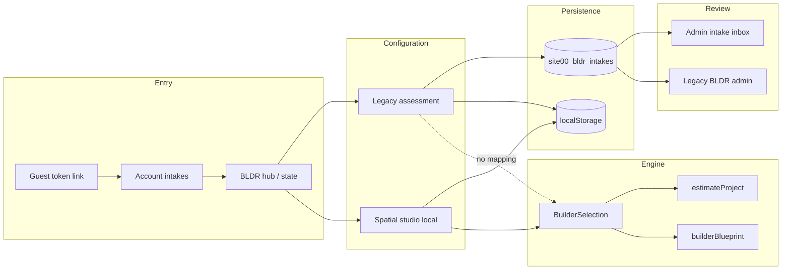

# Builder intake continuity map V1

Lifecycle: **INVITATION → INTAKE → BUILDER CONFIGURATION → BLUEPRINT → ESTIMATE → SUBMISSION → FOUNDER REVIEW → REVISION → ACCEPTANCE → PRODUCTION HANDOFF**

This map reflects **what the repository implements today**, not the approved Opus visual target alone.

## Canonical continuity (recommended principle)

**ONE CLIENT · ONE PROJECT CONTEXT · ONE CONTINUOUS EXPERIENCE**

Shared infrastructure that already supports this for Builder:

- Table: `site00_bldr_intakes` (single row per intake session)
- Polymorphic API: `IntakeType = 'BUILDER'`
- Lineage columns: `user_id`, `project_id`, `organization_id`, `engagement_id` (see migrations `20260821020947`, `20260821021310`)
- Audit: `site00_intake_events`
- Guest access: `site00_intake_access_tokens` (hashed)

Digital Foundation uses a **different** artifact (`shared/site00-digital-foundation/`). Do not force Builder into DF tables.

---

## Stage-by-stage map

| Stage | Implemented behavior | Primary code / route | Gap |
| --- | --- | --- | --- |
| **Invitation** | Generic marketing/entry; no dedicated Builder invite token besides intake guest access | `/bldr`, IDNTY prefill into assessment | No personalized Builder invitation product |
| **Intake start** | `POST /api/site00/intakes?action=start` (`intakeType: BUILDER`) | `intakeService.startIntake`, `useIntakeSync.ensureStarted` | Spatial studio never starts intake |
| **Builder configuration** | Legacy: phased Q&A in `answers`. Spatial: `SpatialBuilderState` | `useBldrAssessment`, `spatialStudio/*` | Two configuration shapes; only spatial maps to estimator contract |
| **Blueprint** | Computed view, not stored as first-class row | `clientView.builderBlueprint`, `blueprintSessionContract` | No server snapshot of blueprint + estimate version on submit |
| **Estimate** | Live from selection; version `ESTIMATOR_VERSION` on snapshot | `builderEstimateView`, `toEstimateConfig` | Founder Refined Range / quote stages **CONTRACT ONLY** in docs |
| **Submission** | `submitIntake` copies `draftPayload` → `submitted_payload`, status `SUBMITTED` | `intakeService.submitIntake` | Spatial path does not call API |
| **Founder review** | `MARK_IN_REVIEW`, audit events; legacy BLDR mark reviewed/convert | `IntakeDetailPage`, `adminOperations` BLDR helpers | No blueprint-specific review UI; admin sees JSON payload |
| **Revision** | Client autosave rejected after submit | `autosaveIntake` validation | No “request changes → client edits → resubmit” Builder flow |
| **Acceptance** | Manual `CONVERTED` / project link; IDNTY has commercial activation hook | `identityCommercial.ts` (IDENTITY only on submit) | Builder lacks parallel post-submit automation |
| **Production handoff** | `project_id` on intake; experience profile synthesis from `experienceAnswers` | `upsertExperienceFromBuilderIntake` | Full `BuilderSelection` not handed to production systems |

---

## Resume / return navigation

| Surface | Resume target | Loads server draft into UI? |
| --- | --- | --- |
| `/intake/access/:token` | `intake.sourceRoute` or `/bldr` | **NO** — link only; legacy assessment reads localStorage, not server `answers` on load |
| `/account/intakes/:type/:id` | Same | **NO** — displays payload JSON; CONTINUE goes to route, not hydrated spatial state |
| Legacy assessment | `useBldrAssessment.resumeTarget` | **PARTIAL** — local record drives resume; server is autosave mirror |
| Spatial studio | Reload same browser | **localStorage only** |

**Client return experience:** **PARTIAL** — infrastructure exists; **hydration from server draft into Builder UI is not implemented** for either legacy or spatial canonical selection model.

---

## Identity cross-over

- IDNTY lore snapshot prefills legacy BLDR steps (`inheritedLoreSnapshot`, site type mapping).
- Spatial FEEL/WORK does not automatically consume IDNTY brand gate outcomes unless Opus wires it.
- Separate IDNTY intake row (`site00_idnty_submissions`) — correct separation; linking via `identity_id` on bldr row when populated.

---

## Single project context — risk register

| Risk | Severity | Notes |
| --- | --- | --- |
| Dual local keys (`BLDR_ASSESSMENT_STORAGE_KEY` vs `site00.bldr.spatialStudio.v1`) | High | Same user can have two configs |
| Server intake optional for spatial | High | Founder sees nothing from studio-only clients |
| `sourceRoute` not set to `/bldr/studio` | Medium | Guest resume misses studio |
| Legacy admin BLDR inbox vs canonical intake inbox | Medium | Two admin surfaces; same underlying table for polymorphic path |
