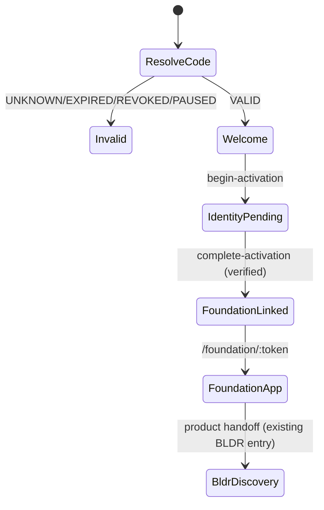

# Opus — Invitation 001 Visual Implementation Handoff

Composer sprint: partner attribution + secure activation foundation (no live payouts, no public launch).

## Journey (functional phases)

| Phase | User moment | Frontend contract | API |
|-------|-------------|-------------------|-----|
| 01 SCAN | QR → browser | Route `/invite/:code` | `GET …/invitation?action=resolve&code=` |
| 02 WELCOME | Partner-aware entry | `InvitationEntryPresentation` | Included in resolve response |
| 03 ACTIVATE | Identity verification | Email + verification step | `begin-activation`, `complete-activation` |
| 04 FOUNDATION | Existing DF journey | Navigate to `/foundation/:token` | `createArtifactForLead` server-side |
| 05 NEXT ADDRESS | BLDR discovery | `presentation.next_address.bldr_available` | Post-Foundation product surfaces |

## Presentation type

`shared/site00-invitation-system/contracts/entryPresentation.ts`

Key fields for Opus:

- `resolution`: `VALID` | `UNKNOWN` | `EXPIRED` | `REVOKED` | `PAUSED` | `RETURNING_USER` | `EXISTING_FOUNDATION` | …
- `collection_label`: `INVITATION 001`
- `partner_presented_through`: subtle — e.g. `PRESENTED THROUGH ALL IN ONE ENTERPRISES INC`
- `headline_candidates[]`: creative territory (not locked copy)
- `activation.requires_identity_verification`: always `true` for new workspace
- `foundation.route`: null until verified activation

## Stub UI (replace with Opus art direction)

- Component: `src/site00/pages/invitation/InvitationEntryPage.tsx`
- Styles: `src/site00/styles/site00-invitation.css`

**Do not** use generic SaaS signup gradients or lead-capture layouts. Direction: luminous white, black editorial type, SITE 00 red accent, architectural spacing.

## State diagram (simplified)

## Partner attribution (data)

- Scan creates **anonymous visit** + `INVITATION_SCANNED` / `INVITATION_VIEWED` (deduped per day bucket).
- **Verified activation** creates `CANDIDATE` attribution — not commission.
- **FOUNDATION_PURCHASED** with verified `payment_id` creates commission **candidate** (zero amount until rates approved).

## Security boundaries for Opus

- QR code is **not** login.
- No email or company name in URL.
- Unknown codes → same generic unavailable treatment (no enumeration).
- Production identity step will bind to existing SITE 00 IDNTY flow (magic link / session) — stub uses admin-only test secret in dev.

## QR asset contract

- Canonical URL: `https://site00.com/invite/aio-office-inv001` (origin configurable for staging)
- Generator: `shared/site00-invitation-system/qr.ts` (SVG, error correction H)
- CLI: `npx tsx scripts/site00/generate-invitation-qr.ts`

## Fixture data for design review

| Code | Behavior |
|------|----------|
| `aio-office-inv001` | Valid AIO office campaign |
| `expired-invitation-fixture` | Expired |
| `revoked-invitation-fixture` | Revoked |
| `unknown-invitation-code` | Unknown |

## Partner reporting (future UI)

Contract: `shared/site00-invitation-system/contracts/partnerReporting.ts`  
Admin JSON: `GET /api/admin/site00-invitation?action=partner-report&partner_id=…`

## Founder review

Contract: `shared/site00-invitation-system/contracts/founderReview.ts`  
Admin JSON: `GET /api/admin/site00-invitation?action=founder-review`

## Physical card (Opus-owned)

Collection **INVITATION 001** — thick luminous white stock, red edge, high-contrast QR, minimal AIO line. Composer does not ship final print artwork in this sprint.

## References

- System doc: `docs/site00/invitation-system/SITE00_INVITATION_SYSTEM_V1.md`
- Campaign seed: `shared/site00-invitation-system/campaigns/aioInvitation001.ts`
- Digital Foundation route: `/foundation/:token` (unchanged product)
