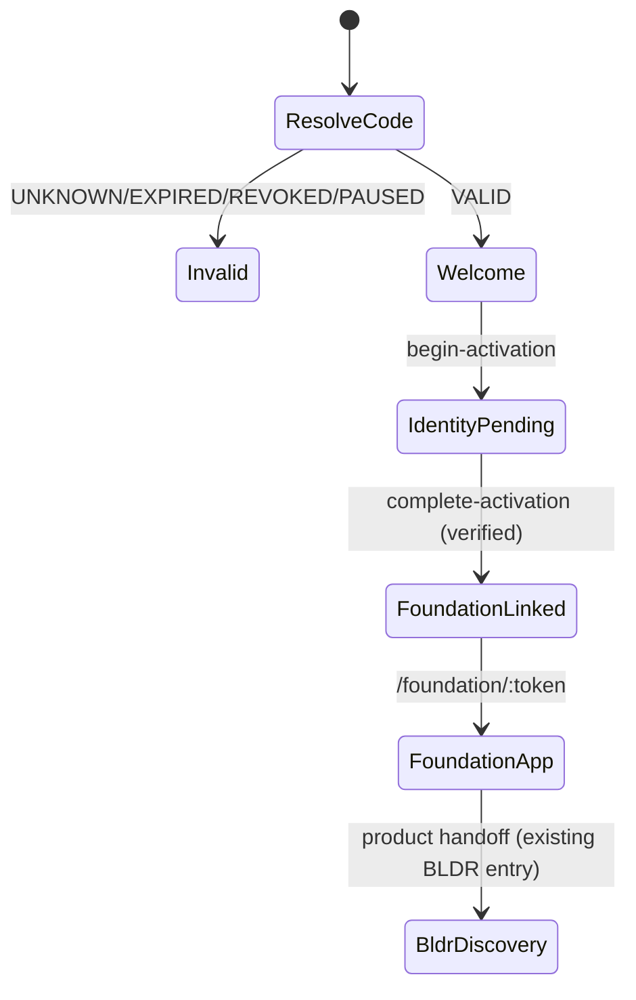

# Opus — Invitation 001 Visual Implementation Handoff

Composer sprint: partner attribution + secure activation foundation (no live payouts, no public launch).

## Journey (functional phases)

| Phase | User moment | Frontend contract | API |
|-------|-------------|-------------------|-----|
| 01 SCAN | QR → browser | Route `/invite/:code` | `GET …/invitation?action=resolve&code=` |
| 02 WELCOME | Partner-aware entry | `InvitationEntryPresentation` | Included in resolve response |
| 03 ACTIVATE | Identity verification | Email + verification step | `begin-activation`, `complete-activation` |
| 04 FOUNDATION | Existing DF journey | Navigate to `/foundation/:token` | `createArtifactForLead` server-side |
| 05 NEXT ADDRESS | BLDR discovery | `presentation.next_address.bldr_available` | Post-Foundation product surfaces |

## Presentation type

`shared/site00-invitation-system/contracts/entryPresentation.ts`

Key fields for Opus:

- `resolution`: `VALID` | `UNKNOWN` | `EXPIRED` | `REVOKED` | `PAUSED` | `RETURNING_USER` | `EXISTING_FOUNDATION` | …
- `collection_label`: `INVITATION 001`
- `partner_presented_through`: subtle — e.g. `PRESENTED THROUGH ALL IN ONE ENTERPRISES INC`
- `headline_candidates[]`: creative territory (not locked copy)
- `activation.requires_identity_verification`: always `true` for new workspace
- `foundation.route`: null until verified activation

## Opus implementation (INVITATION001-PHYSICAL-AND-IMMERSIVE-ACTIVATION-OPUS1)

- Page: `src/site00/pages/invitation/InvitationEntryPage.tsx`. `InvitationExperience` is presentational; the default export owns the effects.
- Journey logic: `src/site00/pages/invitation/invitationJourney.ts`. Pure functions plus fetch wrappers.
- Styles: `src/site00/styles/site00-invitation.css`. CSS-only threshold world, no Three.js.
- Route: `Site00Layout` only. No `Site00PublicRouteShell`, because that shell scales a 1440×900 artboard onto phones.
- Views: `RESOLVING`, `WELCOME` (stages 01 and 02), `ACTIVATE_EMAIL`, `ACTIVATE_VERIFY`, `ACTIVATE_BLOCKED` (stage 03), `READY` (stage 04, plus 05 discovery), `RETURNING`, `RESET`, `UNAVAILABLE` (unknown, revoked, expired, paused), `FAILED` (network, server).
- Verification delivery: `verification_delivery` comes from the resolve response.
  - `DEVELOPMENT_INLINE` (Vite dev local API only) shows the code in a panel labelled DEVELOPMENT ONLY.
  - `PENDING_IDNTY` (Railway / production) shows a blocked state and collects no email.
- Returning visitors: `localStorage['site00.invitation.v1.<code>']` stores only `{ foundation_route, linked_at }`. Status is read from `GET /api/site00/digital-foundation-artifact?action=payload`. A 404 leads to `RESET`.
- Price: `FROM $500` is read from `action=catalog` (`base_price_minor`). Nothing is described as free.
- Browser QA: `node scripts/site00/invitation001/qa-invitation-activation.mjs --base http://127.0.0.1:<port>`. It runs 4 viewports and writes a JSON report.
- Physical card: `docs/site00/invitation-system/invitation-001/README.md`. Founder selection is PENDING.

## Composer blockers before public activation

1. Persistence. The invitation store is in memory. Supabase migration `20261009180000` is prepared but not wired.
2. IDNTY delivery. A real email code or magic link is needed. Until then production stays `PENDING_IDNTY` by design.
3. `completeVerifiedActivation` returns the Foundation token for an already-linked activation without re-checking the secret, so `activation_id` behaves as a bearer. Require a session or the secret on repeat.
4. There is no rate limiting on `resolve`, `begin-activation`, or `complete-activation`.
5. Payment webhook attribution (`FOUNDATION_PURCHASED`) still needs to be wired to the real checkout events.
6. The attribution policy is still `PENDING_FOUNDER`.
7. The production QR must be re-exported as vector and scanned on a physical proof.
8. The red differs: product token `--site-red` is `#e8192c`, while the invitation brief and this page use `#E50107`. The founder should pick the canonical value.
9. The `/foundation/:token` destination still uses the Composer styling and does not yet match the invitation's visual language.
10. Dev-only: React StrictMode runs resolve twice, so each dev page load records two visits. Production renders once.

**Do not** use generic SaaS signup gradients or lead-capture layouts. Direction: luminous white, black editorial type, SITE 00 red accent, architectural spacing.

## State diagram (simplified)

## Partner attribution (data)

- Scan creates **anonymous visit** + `INVITATION_SCANNED` / `INVITATION_VIEWED` (deduped per day bucket).
- **Verified activation** creates `CANDIDATE` attribution — not commission.
- **FOUNDATION_PURCHASED** with verified `payment_id` creates commission **candidate** (zero amount until rates approved).

## Security boundaries for Opus

- QR code is **not** login.
- No email or company name in URL.
- Unknown codes → same generic unavailable treatment (no enumeration).
- The production identity step will bind to the existing SITE 00 IDNTY flow (magic link or session). Until then, the Vite dev local API returns a labelled development code, and every other environment blocks activation (`PENDING_IDNTY`).

## QR asset contract

- Canonical URL: `https://site00.com/invite/aio-office-inv001` (origin configurable for staging)
- Generator: `shared/site00-invitation-system/qr.ts` (SVG, error correction H)
- CLI: `npx tsx scripts/site00/generate-invitation-qr.ts`

## Fixture data for design review

| Code | Behavior |
|------|----------|
| `aio-office-inv001` | Valid AIO office campaign |
| `expired-invitation-fixture` | Expired |
| `revoked-invitation-fixture` | Revoked |
| `unknown-invitation-code` | Unknown |

## Partner reporting (future UI)

Contract: `shared/site00-invitation-system/contracts/partnerReporting.ts`  
Admin JSON: `GET /api/admin/site00-invitation?action=partner-report&partner_id=…`

## Founder review

Contract: `shared/site00-invitation-system/contracts/founderReview.ts`  
Admin JSON: `GET /api/admin/site00-invitation?action=founder-review`

## Physical card (Opus-owned)

Collection **INVITATION 001**. There are three territories (A THE INVITATION, B THE ACCESS CARD, C THE THRESHOLD) in `docs/site00/invitation-system/invitation-001/`. The founder board, draft print spec, and code-rendered artifacts are there. The founder selection is PENDING and print production is not authorized.

## References

- System doc: `docs/site00/invitation-system/SITE00_INVITATION_SYSTEM_V1.md`
- Campaign seed: `shared/site00-invitation-system/campaigns/aioInvitation001.ts`
- Digital Foundation route: `/foundation/:token` (unchanged product)
