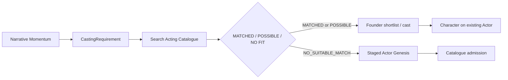

# P0.SW.MODULAR-PRODUCTION-ENGINE-MISSING-LAYERS-AND-OPERATIONALIZATION1

**Augments** [MODULAR-PRODUCTION-ENGINE1.md](./MODULAR-PRODUCTION-ENGINE1.md) — does not replace it.

**Code:** `shared/site00-studio-world/modular-production-engine/operational/`

---

## Role-first casting

Never begin from “generate actors.” Catalogue search returns `MATCHED`, `POSSIBLE_MATCH`, or `NO_SUITABLE_MATCH` before net-new genesis.

---

## Staged Actor Genesis (max 3 face candidates)

| Stage | Purpose |
|-------|---------|
| 1 FACE_CANDIDATES | Up to 3 neutral face explorations — “Is this the person?” |
| 2 IDENTITY_LOCK | `ActorIdentityAuthority` — no silent face swap |
| 3 IDENTITY_ANGLES | Front, 3/4 L/R, profiles |
| 4 NEUTRAL_BODY_AUTHORITY | Fitting uniform (black tee/leggings, plain studio) |
| 5 CATALOGUE_ADMISSION | `ACTIVE_ACTOR` only after founder approval |

Lifecycle: `ACTOR_CANDIDATE` until admission. **No permanent campaign wardrobe** during genesis.

---

## Performance stack

`ACTOR IDENTITY → CHARACTER → PersonalityProfile → BehaviorSkin → MovementSkin → EmotionalRange → VoiceProfile → AnimationSkin → ShotDirection (ephemeral)`

Actor baseline traits may exist; Character personality overrides without overwriting actor record.

---

## Wardrobe / Hair / Makeup

- **StudioWorldWardrobeDepartment** — `WardrobeItem`, categories, `WardrobePull`, **Fitting Room**, `CharacterLookAuthority`
- **Hair** and **Makeup/Grooming** departments — reusable assets, composed into Character Look stack

---

## Environment / Set / Anchors

- **Environment** ≠ **Set** (broad world vs constructed location)
- **SetZone**, **CameraCoverage** library
- **TextAnchor**, **GraphicAnchor**, **PropAnchor** — scene fills anchors instead of inventing signage/props

Set workflow: search → reuse → reskin → customize → net-new only if needed.

---

## Scene assembly

`SceneAssembly` → `SceneGenerationPacket` with reference IDs; delta prompt only.

- **SCENE_UNGROUNDED_ASSET_GUARD** — flags unapproved signage, clothing, people, etc.
- **AssetGap** — resolve before authoritative generation; billable only when intentional

Storyboard panels: cast + environment + set + zone + coverage + props + graphics slots.

---

## Client commercial layer

- `ClientWorkspace`, `ClientBrand`, `EndClientBrand`
- `StudioWorldEntitlementPlan` — configurable allowances (characters vs **new actors** differ)
- `StudioWorldUsageLedger` — allowance vs overage; **no billable entries for hallucinations**
- **REUSE / RESKIN / CUSTOMIZE / NET_NEW** + private/exclusive scopes
- Internal workspaces skip client allowance consumption by default
- **Cost preview** before net-new canonical inventory

---

## Cost guards

Provider dispatch **only** on explicit `CREATE | GENERATE | FIT | RESKIN`. Browse catalogue, wardrobe, sets, entitlements = free.

---

## Departments (studio lot UX target)

Casting, Wardrobe, Hair, Makeup, Performance, Animation, Environments, Sets, Props, Graphics, Locations/Backlot.

Catalogue growth: **on-demand from approved production need** — no bulk hundreds of actors/sets/wardrobe.

---

## Entry 002

`entry002OperationalMigration()` maps SW-017 + temporal looks + authority sheets — **providerDispatchCount: 0**.
