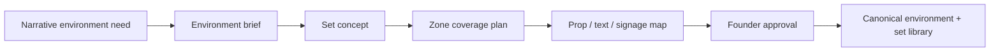
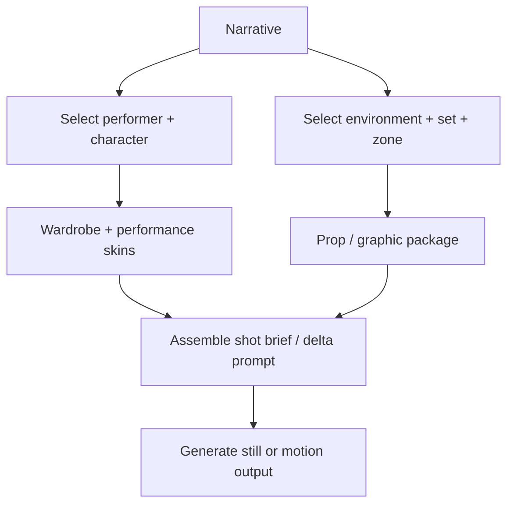

# P0.SW.MODULAR-PRODUCTION-ENGINE1

**Status:** Phase 1 (schema + architecture)  
**Code:** `shared/site00-studio-world/modular-production-engine/`  
**Related:** `shared/site00-studio-world/acting-catalogue/` (Performer layer — partial implementation)

**Operational augmentation:** [MODULAR-PRODUCTION-ENGINE-OPERATIONAL-LAYERS1.md](./MODULAR-PRODUCTION-ENGINE-OPERATIONAL-LAYERS1.md) — role-first casting, staged Actor Genesis, departments, scene packet, client entitlements (`modular-production-engine/operational/`).

---

## Product vision

Studio World is a **modular production engine**: backlot + casting agency + wardrobe department + prop house + environment library + behavior system + animation system.

It replaces one-off image/video prompting with **layered reusable assets** assembled per scene, supporting:

1. Internal brand/campaign production (NDXBOOK, SITE 00, Astral World, etc.)
2. Reusable actor / set / environment generation on demand
3. Client-facing marketing services
4. Monetization via allowances, reskins, and paid expansions

**Non-negotiable:** generate only what is needed; separate identity from wardrobe, behavior, and environment; ground generation in **approved library truth**; describe **delta** in prompts, not whole-world reinvention.

---

## Canonical system model (five layers)

| Layer | Purpose | Sub-layers (summary) |
|-------|---------|----------------------|
| **Performer** | Reusable humans + cast roles + swappable skins | Actor identity, character role, personality/behavior/animation/voice/hair-makeup/wardrobe skins, shot direction |
| **Environment** | Reusable worlds and built sets | World, district, environment, set, zone/angle, lighting, surfaces, signage slots, interaction anchors |
| **Prop / Graphic** | Scene components | Props, screens, signage, framed art, text overlays, printed matter, UI overlays |
| **Wardrobe** | Costume department | Base item, era/mood/formality, role fit, color, fit, accessories |
| **Motion / Performance** | Behavior for still + motion | Posture, walk, gesture, eye/head, emotional cadence, interaction, realism mode |

Type definitions: `layers.ts`, `libraryTypes.ts`.

### Performer rules (aligned with acting catalogue)

- **Actor** = persistent base human (`ActorIdentityAuthority` — immutable).
- **Character** = campaign role on that actor.
- **Wardrobe / personality / behavior / movement** = modular skins — never baked into identity.
- Same actor must support multiple role types across campaigns.

---

## Core libraries (database shape)

Seven library kinds (typed in `libraryTypes.ts`):

1. **Acting Catalogue** — `ActingCatalogueEntry` (bridge from `StudioWorldActor`)
2. **Character Profiles** — role + skin links + approved wardrobe/set links
3. **Environment Library** — categories, sets, lighting, signage slot inventory
4. **Set Library** — zones, angles, prop/graphic anchors, interaction map
5. **Wardrobe Library** — tagged garments with role compatibility
6. **Prop / Graphic Library** — replaceable text/signage-aware assets
7. **Performance Skins** — posture, gesture, walk, eye, cadence, realism mode

Every record carries: **tags, version, approval status, scope tier, exclusivity, client/project scope**.

---

## Generation pipelines

### A. Casting pipeline

- **Input:** campaign context, role function, personality, demographics, optional refs.
- **Rule:** no mass actor generation; catalogue entry only after approval.
- **Implemented (partial):** CAST stage, acting catalogue, Entry 002 retroactive mapping.

### B. Wardrobe pipeline

- Wardrobe library reuse first; net-new styling is explicit.

### C. Environment / set pipeline

- Text-heavy scenes use **signage slots** and replaceable prop/graphic assets to reduce hallucination.

### D. Scene assembly pipeline

- **Rule:** `libraryAssemblyFirst: true`; provider dispatch only at `GENERATE_SCENE_OUTPUT` when packet valid (`pipelines.ts`, `validation.ts`).

---

## Monetization model (marketing clients)

**Scope tiers:** `SHARED_LIBRARY` | `CLIENT_PRIVATE` | `PREMIUM_EXCLUSIVE` | `FOUNDER_INTERNAL_ONLY`

**Generation economics:** `REUSE_EXISTING` (lowest) → `RESKIN_EXISTING` / `CUSTOMIZE_EXISTING` (mid) → `GENERATE_NET_NEW` (premium) → exclusive scope (highest).

**Monthly allowances (examples):**

- 2 character casts / month
- 1 environment or set adaptation / month
- Unlimited reuse of approved shared assets (within tier)
- Limited reskins / month

**Billable expansions:** extra character, extra environment, custom wardrobe/props/signage, premium reskin, client-exclusive actor/environment, extra generations/revisions.

Logic helpers: `monetization.ts` (`canUseAssetWithinAllowance`, `pricingTierForEconomics`).

---

## UI / workspace modules

| Module | Status | Notes |
|--------|--------|-------|
| Casting Workspace | **Partial** | `ExpressionEngineCastPanel`, production journey CAST |
| Acting Catalogue Home | **Partial** | `StudioWorldActingCataloguePanel` |
| Wardrobe Workspace | Spec | Phase 2–3 |
| Environment / Set Workspace | Spec | Phase 2–3 |
| Performance Skin Workspace | Spec | Phase 3 |
| Scene Assembly Workspace | Spec | Phase 4 |
| Client Usage / Billing | Spec | Phase 5 |

Registry: `workspaces.ts`.

---

## Reuse, exclusivity, paid expansion rules

1. **Reuse** — approved shared assets; cheapest; no identity change.
2. **Reskin** — branding/text/surface overlays on approved set or wardrobe; mid-tier.
3. **Customize** — compose new look from library parts; mid-tier.
4. **Net-new** — new actor, environment, or canonical asset; premium; counts against allowance or billable.
5. **Exclusive** — client-private or premium exclusive scope; highest tier; stored in `exclusivity` + `scopeTier`.

Internal Studio World assets default to `FOUNDER_INTERNAL_ONLY` until productized for client tiers.

---

## Phased implementation plan

| Phase | Scope | Deliverables |
|-------|--------|--------------|
| **1** | Schema + architecture | This doc, `modular-production-engine` types, validation rules, bridge to acting catalogue |
| **2** | Libraries + tags | Persist environment/set/wardrobe/prop libraries; approval + tagging API |
| **3** | Casting + env workflows | Wardrobe assignment UI; environment generation workflow; performance skin records |
| **4** | Scene assembly | Narrative → layer picker → shot packet → generation gate |
| **5** | Client monetization | Entitlements, ledger, scope visibility in UI |
| **6** | Downstream + analytics | Still/video grounding IDs; usage reporting per client/asset |

---

## Success criteria (sprint)

- [x] Full architecture spec (this document)
- [x] Canonical object model in TypeScript
- [x] Pipeline stage definitions (casting, wardrobe, environment, scene assembly)
- [x] Monetization + reuse tier model
- [x] Workspace module registry
- [x] Layer separation validation rules
- [x] Phased plan
- [ ] Phases 2–6 implementation (future sprints)

---

## Integration with Expression Engine

Current campaign pipeline:

`COVER → NARRATIVE → CAST → TREATMENT → AUTHORITIES → STORYBOARD → …`

Modular engine extends **CAST** and future **SCENE ASSEMBLY** to pull library IDs into handoffs (actor identity, character authority, set, wardrobe, performance skins) — matching existing storyboard/keyframe character handoff pattern in `acting-catalogue/handoffs.ts`.
